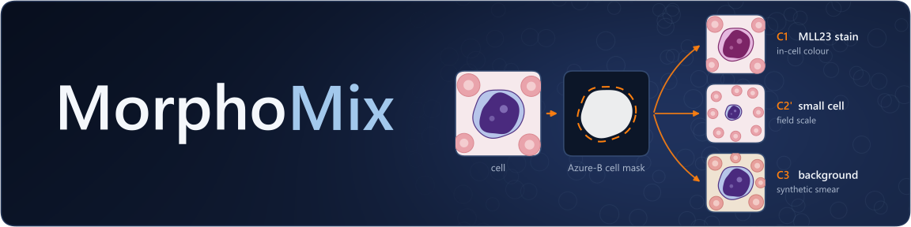

<div align="center">



**Mask-guided augmentation for cross-laboratory acute lymphoblastic leukemia (ALL) classification in blood-smear images.**


</div>

## Overview

MorphoMix augments each training cell through one Azure-B cell mask, so the classifier sees the same cell with
another laboratory's stain, at whole-field scale and on another background. Labels are never mixed.

| Component | What it does |
| --- | --- |
| C1 MLL23 stain | per-region (nucleus / cytoplasm) Lab colour transfer to a reference cell of the MLL23 style bank; only cell pixels change |
| C2' small cell | shrinks the cell to whole-field scale, or renders it as a low-detail cell |
| C3 background | replaces everything outside the cell with a synthetic smear |

It is compared with `basic`, `hed_jitter`, `randstainna`, `stain_mixup` and frozen DinoBloom probes on a ConvNeXt V2
Atto backbone. Each laboratory has one role:

| Dataset | Role |
| --- | --- |
| [C-NMC 2019](https://doi.org/10.7937/tcia.2019.dc64i46r) (+ [Bodzas 2023](https://doi.org/10.6084/m9.figshare.22680517) auxiliary cells) | training |
| [LeukemiaAttri](https://github.com/intelligentMachines-ITU/Blood-Cancer-Dataset-Lukemia-Attri-MICCAI-2024) H_100X_C1 | model selection (L_100X_C1: replicate) |
| [MLL23](https://doi.org/10.5281/zenodo.14277609) | stain style bank (colour statistics only) |
| [ALL-IDB2](https://homes.di.unimi.it/scotti/all/) | test, single cells |
| [Aria](https://doi.org/10.34740/KAGGLE/DSV/2175623) | test, whole fields |

Folder layout and licences: [`data/README.md`](data/README.md). Do not use ALL-IDB1 (ALL-IDB2 is cropped from it),
and do not redistribute ALL-IDB2 images. Changes made after the test cohorts were seen are recorded in
[`docs/decision_log.md`](docs/decision_log.md).

> Research code only; not a diagnostic device.

## Usage

```bash
pip install torch torchvision && pip install -r requirements.txt
python main.py prepare && python main.py split && python main.py split --allidb2   # build data/processed
python main.py pretrain --aug morpho_mix --seed 42                                  # one run
python main.py all                                                                  # the whole protocol, resumable
python main.py --help                                                               # every command
```

All hyperparameters are in [`configs/config.yaml`](configs/config.yaml), set for a Colab A100; the reported runs use
[`colab/MorphoMix_colab.ipynb`](colab/MorphoMix_colab.ipynb) with the archives from `python colab/pack.py`.

## Repository

```text
main.py          command dispatcher
configs/         config.yaml
scripts/         data, train, experiments, evaluate, foundation, audit, paper_stats, figures, run_all
src/             augmentations, cam, datasets, training, evaluation, models, utils
colab/           notebook, job runner, archive builder
docs/            decision log
```

## Paper

The paper is in preparation; the link will be added here on publication.

## License

Copyright (c) 2026. All rights reserved until the paper is published. See [LICENSE](LICENSE).